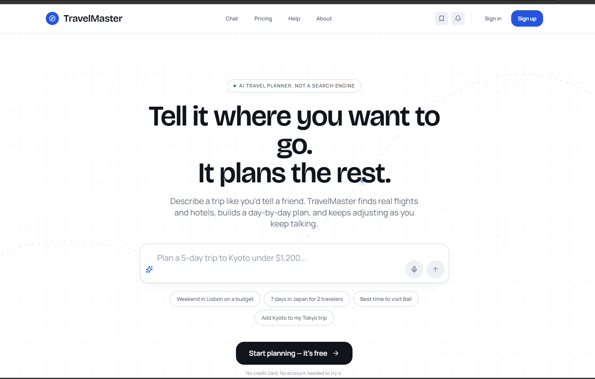
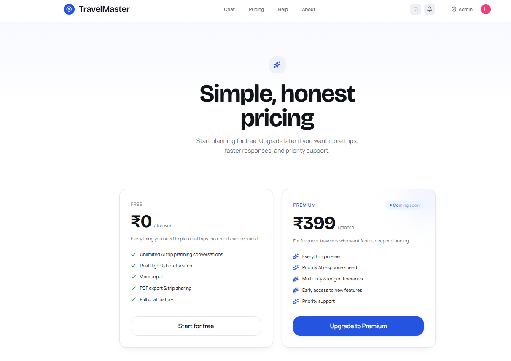
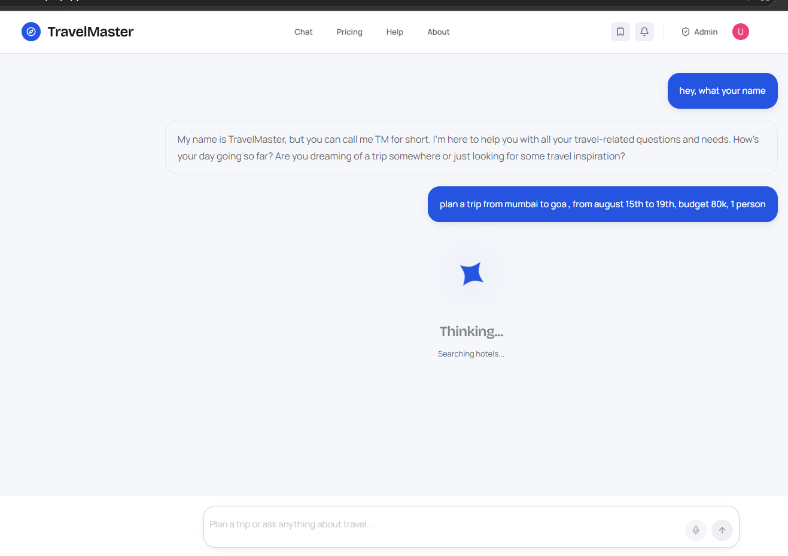
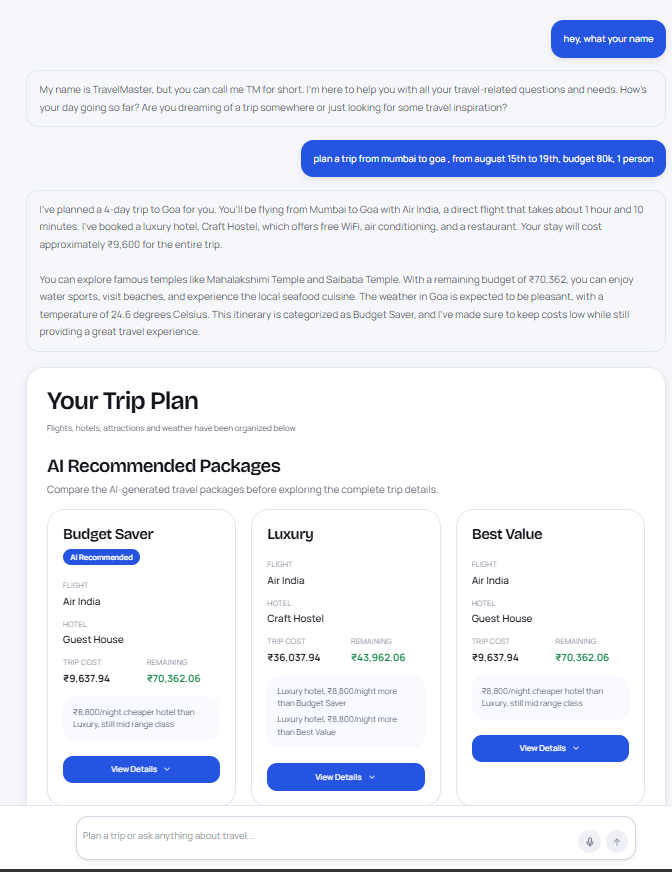
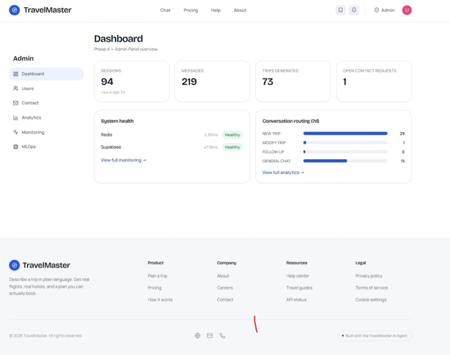
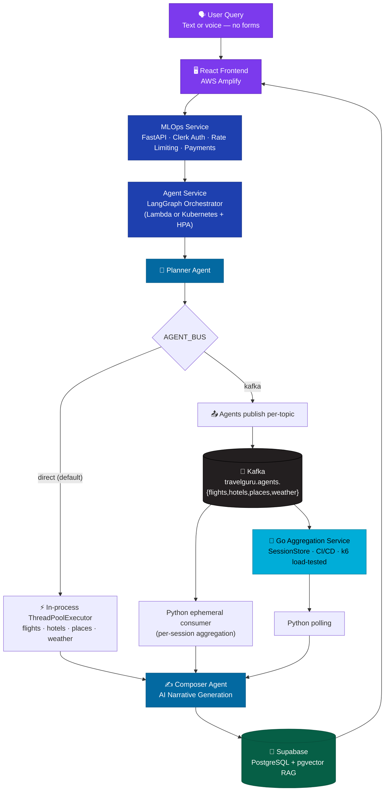

<p align="center">
  <!-- ============================================================ -->
  <!-- REPLACE: Upload your banner to GitHub and paste the URL here -->
  <!-- ============================================================ -->
  
</p>

<p align="center">
  <a href="https://main.d2dqny356lcrsz.amplifyapp.com"></a>
  <a href="https://github.com/uditnegi16/TravelMasterV2"></a>
  <a href="https://github.com/uditnegi16/TravelMasterV2/actions/workflows/go-aggregator-ci.yml"></a>
  <a href="#"></a>
</p>

<p align="center">
  
  
  
  
  
</p>

<p align="center">
  
  
  
  
  
  
</p>

<p align="center">
  
  
  
  
  
</p>

---

## Overview

TravelMaster is a full-stack AI SaaS that plans complete trips from a single sentence. Type a natural language query — TravelMaster orchestrates a **LangGraph multi-agent system** that searches flights, hotels, places, and weather **in parallel**, ranks results with a scoring pipeline, transcribes voice input, and generates an AI travel narrative.

It's deployed serverless on **AWS Lambda** by default, with an alternative **Kubernetes deployment (HPA autoscaling 2→8 replicas)** for steady high-throughput traffic, and a production **Kafka event bus** — including a load-tested, CI/CD-backed **Go aggregation microservice** — as a scalable path for consuming agent output at volume. It also ships a full admin panel, tier-based rate limiting, Razorpay payments, PDF export, and shareable trip links.

> *"Plan a 3-day trip from Delhi to Mumbai for 2 adults, budget ₹30k, March 25–27"*
>
> → Ranked flights · Hotels · Places to visit · Weather forecast · Budget breakdown · AI narrative — in seconds. Type it, or say it — voice input is built in.

---

## What's Recently Shipped

A running log of the platform's evolution beyond the original MVP — the parts that tend to matter most to anyone reviewing the engineering, not just the product:

- **Kafka-based agent bus** — agents can publish results to per-topic Kafka streams instead of returning them in-process, toggled with a single env var (`AGENT_BUS=direct|kafka`), with zero change to the trip-planning API surface. See [`docs/kafka-architecture.md`](docs/kafka-architecture.md).
- **Go aggregation microservice** — a standalone, production-hardened Go service that consumes those Kafka topics, merges results by session, and serves them over HTTP. Ships with graceful shutdown, config validation, Prometheus metrics, pprof profiling, and a GitHub Actions CI pipeline (format → vet → test → build → Docker). See [`apps/backend/go-kafka-consumer`](apps/backend/go-kafka-consumer).
- **Load-tested with k6** — benchmarked at 10 / 50 / 100 concurrent virtual users with 0 failed requests across all runs. See [Performance & Load Testing](#performance--load-testing) below.
- **Dual deployment targets for the agent service** — the same LangGraph service ships both as an AWS Lambda (per-invocation scaling, the default) and as a Kubernetes Deployment with an HPA (CPU/memory-based autoscaling for steady-state load). See [`k8s/agent-service`](k8s/agent-service).
- **Resilience patterns** — a circuit breaker around the flights provider, feature flags, and a subscription guard protecting rate-limited endpoints.
- **RAG evaluation harness** — a scored retrieval evaluation suite (`evaluations/evaluate_retrieval.py`) against a fixed test dataset, instead of eyeballing RAG quality.

---

## Demo

<!-- ================================================================ -->
<!-- HOW TO EMBED YOUR VIDEO (GitHub renders MP4 natively):           -->
<!-- 1. Go to your repo → Issues → New Issue                          -->
<!-- 2. Drag and drop your .mp4 file into the comment box             -->
<!-- 3. GitHub generates a URL like:                                  -->
<!--    https://github.com/user/repo/assets/USERID/FILEID.mp4        -->
<!-- 4. Paste that URL below on its own line — no markdown needed     -->
<!-- 5. Delete these instructions after replacing the URL             -->
<!-- ================================================================ -->

YOUR_GITHUB_VIDEO_ASSET_URL_HERE

---

## 🌐 Live Demo

| Service | URL |
|---------|-----|
| Frontend | https://main.d2dqny356lcrsz.amplifyapp.com |
| MLOps API | https://g2d019moz2.execute-api.ap-south-1.amazonaws.com/prod/health |
| Agent API | https://napum590vf.execute-api.ap-south-1.amazonaws.com/prod/health |

> ⚠️ Double-check these are still live before sharing this README externally — endpoints on free/dev AWS tiers tend to drift.

---

## Screenshots

<!-- ================================================================ -->
<!-- HOW TO ADD SCREENSHOTS:                                          -->
<!-- 1. Take screenshots using Windows Snipping Tool (Win+Shift+S)    -->
<!-- 2. Create a /screenshots folder in your repo                     -->
<!-- 3. Upload the images below                                       -->
<!-- 4. The paths below will auto-resolve once images are uploaded    -->
<!-- ================================================================ -->
<!-- Screenshots to capture:                                          -->
<!-- 1. landing.png    — Landing page hero before login               -->
<!-- 2. chat.png       — Chat / plan-trip experience with results     -->
<!-- 3. trip.png       — Flights/hotels/places/weather results        -->
<!-- 4. pdf.png        — Downloaded PDF opened in browser             -->
<!-- 5. admin.png      — Admin dashboard with metrics                 -->
<!-- 6. kafka-ui.png   — Kafka UI showing agent topics (nice touch)   -->
<!-- ================================================================ -->

<p align="center">
  
   
</p>
<p align="center">
  
  
</p>
<p align="center">
  
</p>

---

## System Architecture

<!-- ================================================================ -->
<!-- REPLACE: Upload your architecture diagram to /docs/ in the repo  -->
<!-- and replace the src URL below, or keep the Mermaid diagram below -->
<!-- ================================================================ -->



**Two independent scaling levers, by design:**

1. **How agent orchestration runs** — `AGENT_BUS=direct` (default, no infra) vs `AGENT_BUS=kafka` (replayable, decoupled, observable via `/admin/kafka/lag`). Full write-up: [`docs/kafka-architecture.md`](docs/kafka-architecture.md).
2. **Where the agent service runs** — AWS Lambda (default, per-invocation scaling, zero idle cost) vs a Kubernetes Deployment with an HPA (steady-state, predictable-load scaling). Full write-up: [`k8s/agent-service/README.md`](k8s/agent-service/README.md).

---

## Performance & Load Testing

The Go aggregation service was load-tested with **k6** at 10, 50, and 100 concurrent virtual users (30s per run) against `GET /result/{session_id}`, returning a full aggregated trip payload (~625 KB/response).

| Virtual Users | Requests/sec | Avg Latency | p95 Latency | Errors |
|---|---|---|---|---|
| 10  | 490 req/s | 19.97 ms  | 39.24 ms  | 0 |
| 50  | **981 req/s** | 49.60 ms  | 105.16 ms | 0 |
| 100 | 734 req/s | 133.09 ms | 253.38 ms | 0 |

- **66,317 requests served across all benchmark runs — 0 failures, 100% success rate.**
- Throughput scaled nearly linearly from 10→50 VUs; 50→100 VUs showed graceful degradation (throughput dipped ~25%, latency rose ~2.7×) consistent with the service becoming CPU/serialization-bound rather than failing outright.
- Full methodology, per-run breakdowns, and optimization backlog (gzip compression, `sync.Pool`, HTTP/2, response caching) are recorded in [`docs/phase-logs/phase-10.md`](docs/phase-logs/phase-10.md).

---

## Tech Stack

| Layer | Technology |
|-------|-----------|
| Frontend | React 19, Vite, TypeScript, React Router 7, Tailwind CSS, Framer Motion |
| Auth | Clerk (JWT-based, protected routes) |
| MLOps Backend | FastAPI, Python 3.12, Mangum (Lambda adapter) |
| AI Agent Service | LangGraph, LangChain, FastAPI, Python 3.12 — deployable to Lambda **or** Kubernetes |
| LLM | Groq `llama-3.3-70b-versatile`, NVIDIA NIM |
| Voice Input | `faster-whisper` (local CPU transcription, no external API call) |
| Flights | Duffel API, behind a circuit breaker |
| Hotels | OpenStreetMap Nominatim (structured lodging search) |
| Places | OpenTripMap API |
| Weather | Open-Meteo |
| RAG / Knowledge Base | Supabase `pgvector`, with a dedicated retrieval evaluation harness |
| Async Event Bus | Apache Kafka (`kafka-python` on the Python side) |
| High-Throughput Aggregation | **Go 1.24**, `segmentio/kafka-go`, Prometheus client, k6-load-tested |
| Database | Supabase (PostgreSQL) |
| Cache | Upstash Redis |
| PDF Export | ReportLab + AWS S3 presigned URLs |
| Payments | Razorpay (REST API) |
| Email | AWS SES (boto3) |
| Frontend Hosting | AWS Amplify (CI/CD from GitHub) |
| Backend Hosting | AWS Lambda + API Gateway, **or** Kubernetes (Deployment + HPA + Service) |
| Infrastructure as Code | AWS SAM (Lambda), raw manifests (Kubernetes) |
| CI/CD | GitHub Actions (format, vet, unit tests, build, Docker image build) |
| Observability | AWS CloudWatch, Prometheus metrics + pprof (Go service), Kafka consumer-lag endpoint |

---

## Features

- **Natural Language Planning** — no forms, no dropdowns, describe the trip in plain English (or speak it)
- **Voice Input** — on-device transcription via `faster-whisper`, no third-party voice API dependency
- **LangGraph Multi-Agent** — planner agent → tool router → composer agent, with flights/hotels/places/weather fetched in parallel
- **Resilience Built In** — circuit breaker around the flights provider, feature flags, subscription guard on rate-limited routes
- **Kafka Event Bus (optional)** — swap the in-process agent pipeline for a Kafka-mediated one with one env var; replay any session's raw agent output for debugging, observe per-topic consumer lag
- **Go Aggregation Microservice** — a purpose-built, benchmarked, CI-tested Go service for consuming agent output at volume
- **Tier-Based Rate Limiting** — free vs premium quotas, configurable from the admin panel without a redeploy
- **Session History** — all past trips saved, searchable, re-openable
- **PDF Export** — full trip plan downloaded via an AWS S3 presigned URL
- **Trip Sharing** — public read-only link, no login required
- **Payments** — Razorpay checkout for premium tier upgrades
- **Contact & Support Flow** — public contact form with a triage workflow (`new → in_progress → resolved`) in the admin panel
- **Admin Suite** — dashboard, user management, live health checks, config flags, audit log, Kafka monitoring, MLOps status, analytics
- **Dark / Light Mode** — system preference detection with manual toggle and persistence
- **Dual Deployment** — the agent service runs identically on Lambda (serverless) or Kubernetes (HPA-autoscaled)
- **RAG Quality Evaluation** — a scored retrieval eval harness against a fixed test dataset, not manual spot-checks
- **Email Notifications** — welcome, limit reached, trip ready — via AWS SES

---

## Why TravelMaster

| Traditional Travel Apps | TravelMaster |
|------------------------|-------------|
| Search forms with dropdowns | Plain English (or voice) natural language input |
| Manual comparison across tabs | AI-ranked results in one view |
| Static results, no scoring | Scoring pipeline across price, rating, convenience |
| No narrative or context | Full budget breakdown + AI trip narrative |
| No admin control | Full ops dashboard with real-time config flags and Kafka lag monitoring |
| Fixed rate limits in code | Configurable per tier from the database, zero redeploy |
| One deployment target | Ships to Lambda *or* Kubernetes from the same codebase |
| "It works on my machine" | CI pipeline (format → vet → test → build → Docker) gates every commit to the Go service, plus a k6-backed performance baseline |

---

## Infrastructure

| Service | Purpose |
|---------|---------|
| AWS Amplify | Frontend hosting + auto CI/CD from GitHub push |
| AWS Lambda | MLOps backend + Agent backend (serverless, default) |
| Kubernetes (EKS-compatible manifests) | Alternative agent-service deployment — 2–8 replica HPA, `travelguru` namespace |
| Amazon API Gateway | Public HTTPS endpoints for both Lambdas |
| Amazon S3 (`travelmaster-pdfs`) | PDF storage + presigned URL delivery |
| AWS SAM | Infrastructure as code for the Lambda deployments |
| Apache Kafka | Async agent-result event bus (`infra/kafka/docker-compose.yml` for local dev) |
| Amazon CloudWatch | Lambda logs and error monitoring |
| AWS SES | Transactional emails |
| GitHub Actions | CI pipeline for the Go aggregation service |

---

## Local Development

### Prerequisites

- Python 3.12
- Node.js 18+
- Go 1.24 (only needed if you're working on the Kafka aggregation path)
- [uv](https://github.com/astral-sh/uv) — `pip install uv`
- Docker (for local Kafka, optional)
- Supabase account + project
- Clerk account
- [Duffel](https://duffel.com) API token (flights, sandbox available)
- Groq API key — free at [console.groq.com](https://console.groq.com)
- [OpenTripMap](https://opentripmap.io) API key (places)
- Razorpay account (payments, optional for local dev)

> Hotels (Nominatim) and weather (Open-Meteo) need no API key.

### Clone

```bash
git clone https://github.com/uditnegi16/TravelMasterV2.git
cd TravelMasterV2
```

### Terminal 1 — Agent Service (LangGraph)

```bash
cd apps/backend/agent_service
```

Create a `.env` with (see `services/*.py` for the full list each service reads):

```env
DUFFEL_API_TOKEN=your_duffel_token
OPENTRIPMAP_API_KEY=your_opentripmap_key
GROQ_API_KEY=your_groq_key
SUPABASE_URL=https://your-project.supabase.co
SUPABASE_SERVICE_ROLE_KEY=your_service_role_key
AGENT_BUS=direct
```

Install and run:

```bash
uv venv
source .venv/bin/activate   # .venv\Scripts\activate on Windows
uv pip install -r requirements.txt
uvicorn main:app --reload --port 8001
```

✅ Agent service running at `http://127.0.0.1:8001`

### Terminal 2 — MLOps Backend

```bash
cd apps/backend/mlops_service
```

Create a `.env` from `.env.example`:

```env
SUPABASE_URL=https://your-project.supabase.co
SUPABASE_SERVICE_ROLE_KEY=your_service_role_key
SUPABASE_ANON_KEY=your_anon_key
CLERK_SECRET_KEY=your_clerk_secret_key
CLERK_JWKS_URL=https://your-clerk-domain.clerk.accounts.dev/.well-known/jwks.json
UPSTASH_REDIS_REST_URL=your_redis_url
UPSTASH_REDIS_REST_TOKEN=your_redis_token
RAZORPAY_KEY_ID=your_razorpay_key_id
RAZORPAY_KEY_SECRET=your_razorpay_key_secret
AGENT_SERVICE_URL=http://localhost:8001
APP_URL=http://localhost:5173
```

Run:

```bash
uv venv
source .venv/bin/activate
uv pip install -r requirements.txt
uvicorn main:app --reload --port 8000
```

✅ MLOps backend running at `http://127.0.0.1:8000`

### Terminal 3 — Frontend

```bash
cd apps/frontend
```

Create a `.env` from `.env.example`:

```env
VITE_API_BASE=http://127.0.0.1:8000
VITE_CLERK_PUBLISHABLE_KEY=pk_test_your_clerk_publishable_key
VITE_RAZORPAY_KEY_ID=your_razorpay_key_id
```

Run:

```bash
npm install
npm run dev
```

✅ Frontend running at `http://localhost:5173`

---

## Kafka Path (Optional, Local)

To exercise the Kafka-mediated agent pipeline instead of the in-process default:

```bash
docker compose -f infra/kafka/docker-compose.yml up -d
# Kafka on localhost:9092, Kafka UI on http://localhost:8080

cd apps/backend/agent_service
export AGENT_BUS=kafka
export KAFKA_BOOTSTRAP_SERVERS=localhost:9092
uvicorn main:app --reload --port 8001
```

`POST /plan-trip` behaves identically — what changes is that `travelguru.agents.{flights,hotels,places,weather}` now carry messages, inspectable via Kafka UI or `GET /admin/kafka/lag`. Full details: [`docs/kafka-architecture.md`](docs/kafka-architecture.md).

### Go Aggregation Service

```bash
cd apps/backend/go-kafka-consumer
go mod download
go run .
```

Runs three HTTP servers: the aggregation API (`:8081`, results at `GET /result/{session_id}`, health at `/health/live` and `/health/ready`), Prometheus metrics (`:2112/metrics`), and pprof (`:6060`). Config is env-driven and validated at startup — see `internal/config/config.go`.

Run the test suite / CI checks locally:

```bash
gofmt -l .
go vet ./...
go test ./... -v -race
go build .
```

---

## AWS Deployment (Lambda)

### Prerequisites

- AWS CLI configured (`aws configure`)
- SAM CLI installed — [install guide](https://docs.aws.amazon.com/serverless-application-model/latest/developerguide/install-sam-cli.html)
- S3 bucket: `aws s3 mb s3://travelmaster-pdfs --region ap-south-1`

### Deploy Agent Lambda

```bash
cd apps/backend/agent_service
sam build
sam deploy --guided
```

Stack name: `travelmaster-agent` · Region: `ap-south-1`

### Deploy MLOps Lambda

```bash
cd apps/backend/mlops_service
sam build
sam deploy --guided
```

Stack name: `travelmaster-mlops` · Region: `ap-south-1`

### Deploy Frontend

Push to `main` — Amplify auto-deploys on every push.

**Required Amplify environment variables:**

```
VITE_CLERK_PUBLISHABLE_KEY = pk_live_your_key
VITE_API_BASE = https://g2d019moz2.execute-api.ap-south-1.amazonaws.com/prod
```

---

## Kubernetes Deployment (Alternative to Lambda)

The agent service also ships as a standalone Kubernetes Deployment — same codebase, different entrypoint (`uvicorn main:app` via `Dockerfile.k8s` instead of the Lambda handler), for workloads that benefit from steady-state HPA autoscaling instead of per-invocation Lambda scaling.

```bash
cd apps/backend/agent_service
docker build -f Dockerfile.k8s -t travelguru/agent-service:latest .

kubectl apply -f ../../../k8s/agent-service/namespace.yaml
kubectl apply -f ../../../k8s/agent-service/configmap.yaml

cp ../../../k8s/agent-service/secret.example.yaml /tmp/secret.yaml
# fill in /tmp/secret.yaml, then:
kubectl apply -f /tmp/secret.yaml
rm /tmp/secret.yaml

kubectl apply -f ../../../k8s/agent-service/deployment.yaml
kubectl apply -f ../../../k8s/agent-service/service.yaml
kubectl apply -f ../../../k8s/agent-service/hpa.yaml
```

Scales 2→8 replicas on CPU (70%) / memory (80%) utilization. Full details: [`k8s/agent-service/README.md`](k8s/agent-service/README.md).

---

## Database Setup

Run these, in order, in your Supabase SQL editor:

1. 📄 [`database/schema.sql`](database/schema.sql) — core tables
2. 📄 [`database/indexes.sql`](database/indexes.sql) — indexes
3. 📄 [`database/match_travel_knowledge.sql`](database/match_travel_knowledge.sql) — pgvector similarity search function for RAG
4. 📄 [`database/admin_panel_migration.sql`](database/admin_panel_migration.sql) — admin panel contact-triage workflow

---

## Admin Setup

Get your Clerk user ID from Clerk Dashboard → Users → click your account → copy the `user_xxx` ID.

```sql
INSERT INTO user_db.admin_users (clerk_user_id, email, role, is_active)
VALUES ('user_your_clerk_id_here', 'your@email.com', 'super_admin', true);
```

Sign in on the live app → auto-redirected to `/admin/dashboard`.

---

## User Tiers

| Feature | Free | Premium |
|---------|------|---------|
| AI trip searches / month | **5** | **100** |
| Flights + Hotels + Places | ✅ | ✅ |
| Weather + Budget breakdown | ✅ | ✅ |
| Voice input | ✅ | ✅ |
| Session history | ✅ | ✅ |
| Save trips | ✅ | ✅ |
| PDF export | ✅ | ✅ |
| Shareable trip links | ✅ | ✅ |

> Limits reset at the start of every month. Admins can manually reset any user from the Admin panel.

---

## Admin Panel

| Page | Purpose |
|------|---------|
| Dashboard | Business metrics — users, searches, success rate |
| Users | Upgrade tier, ban users, reset monthly limit |
| Health | Live Lambda + Supabase service status |
| Config | Edit rate limits + feature flags — no redeploy needed |
| Monitoring | Kafka consumer lag and cluster health (`/admin/kafka/*`) |
| MLOps | MLOps service status and metrics |
| Analytics | Usage trends over time |
| Contact | Contact form submissions with a `new → in_progress → resolved` triage workflow |
| Audit Log | All admin actions with timestamp |

---

## Common Issues

**Flights come back empty** — check `DUFFEL_API_TOKEN`; the flights service is wrapped in a circuit breaker, so a bad/missing token trips it open rather than retrying indefinitely.

**Places search unavailable** — `OPENTRIPMAP_API_KEY` isn't set. It's required; there's no fallback provider currently wired in for places.

**Hotels/places search feels slow or occasionally empty** — hotel and (fallback) place lookups hit OpenStreetMap's public Nominatim instance, which enforces a strict 1 request/sec policy. This is a known, documented tradeoff of using a free geocoder.

**`Invalid API key` (Supabase)** — ensure `SUPABASE_SERVICE_ROLE_KEY` starts with `eyJ` with no surrounding whitespace.

**`monthly_limit_reached`** — go to Admin → Users → Reset, or:
```sql
UPDATE user_db.user_profiles SET searches_this_month = 0 WHERE email = 'your@email.com';
```

**PDF corrupted** — ensure S3 presigned URL delivery is used, not a direct binary response through API Gateway.

**Go service: `go: go.mod requires go >= 1.24`** — install Go 1.24+; the aggregation service is pinned to match its dependencies' minimum version.

---

## Project Structure

```
TravelMasterV2/
├── apps/
│   ├── backend/
│   │   ├── agent_service/            ← LangGraph AI agent (FastAPI)
│   │   │   ├── graph/                ← Planner, Composer, Tool Router, Kafka aggregator node
│   │   │   ├── services/             ← Duffel, OpenTripMap, Open-Meteo, Nominatim, Razorpay, Whisper
│   │   │   ├── shared/                ← Circuit breaker, feature flags, subscription guard, cache
│   │   │   ├── retrieval/            ← RAG chunking, embedding, reranking
│   │   │   ├── evaluations/          ← Retrieval quality evaluation harness
│   │   │   ├── kafka_bus/            ← Kafka producer/consumer, admin/lag helpers
│   │   │   ├── api/                  ← chat, admin, payment, contact, voice, kafka-monitor routes
│   │   │   ├── lambda_handler.py     ← AWS Lambda entry point
│   │   │   ├── Dockerfile            ← Lambda container image
│   │   │   ├── Dockerfile.k8s        ← Kubernetes container image
│   │   │   └── template.yml          ← SAM deployment config
│   │   ├── mlops_service/            ← FastAPI MLOps backend (auth, rate limiting, payments)
│   │   │   ├── utils/                ← Health logging, etc.
│   │   │   └── lambda_handler.py     ← AWS Lambda entry point
│   │   └── go-kafka-consumer/        ← Go aggregation microservice
│   │       ├── internal/
│   │       │   ├── aggregator/       ← Session aggregation + trip builder
│   │       │   ├── api/              ← HTTP API (results, health endpoints)
│   │       │   ├── config/           ← Env-driven, validated configuration
│   │       │   ├── kafka/            ← Kafka consumer
│   │       │   └── metrics/          ← Prometheus metrics
│   │       ├── benchmarks/           ← k6 load test script
│   │       └── Dockerfile
│   └── frontend/                     ← React app (AWS Amplify)
│       ├── src/app/routes/           ← Public, app, and admin/ pages
│       └── src/app/components/       ← Shared UI, chat, trip result components
├── infra/kafka/                      ← Local Kafka + Kafka UI docker-compose
├── k8s/agent-service/                ← Kubernetes manifests (Deployment, HPA, Service, ConfigMap)
├── database/                         ← SQL schema, indexes, RAG search function, migrations
├── knowledge_base/                   ← RAG source documents (destinations, visas, budgets, etc.)
├── docs/                             ← Architecture notes, phase logs, decision log
└── README.md
```

---

## License

MIT — built for portfolio demonstration purposes.

---

<p align="center">
  Built with ☕ and frustration in India 🇮🇳
</p>
