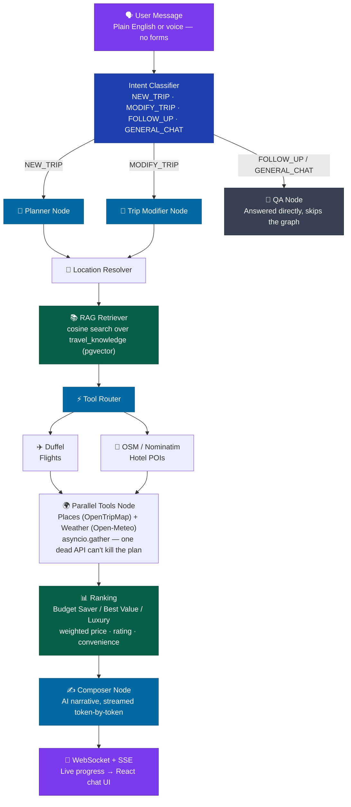

<p align="center">
  <!-- ============================================================ -->
  <!-- REPLACE: Upload your banner to GitHub and paste the URL here -->
  <!-- ============================================================ -->
  
</p>

<p align="center">
  <a href="https://main.d2dqny356lcrsz.amplifyapp.com/chat/"></a>
  <a href="https://github.com/uditnegi16/TravelMasterV2"></a>
  <a href="#"></a>
  <a href="#"></a>
  <a href="#"></a>
  <a href="#"></a>
</p>

<p align="center">
  
  
  
  
  
  
</p>

<p align="center">
  
  
  
  
</p>

---

## Overview

TravelGuru v2 is a ground-up rebuild of the original [TravelMaster](https://github.com/uditnegi16/Travelmaster) project — same core idea, production-minded engineering underneath. Describe a trip in one sentence, and a **LangGraph multi-agent pipeline** pulls real flights, real hotels, real places, and real weather, ranks them, grounds the writeup in a **retrieval-augmented knowledge base**, and streams back a narrated itinerary — with voice input, a chat-style planning surface, Razorpay premium billing, and an admin panel behind it.

Owned API keys instead of shared ones. Graceful degradation when a provider goes down — circuit breakers around every external tool, parallel failure-isolated calls, and a dual-LLM fallback so one dead provider or rate limit never takes down the whole plan. A real payment flow. A RAG layer that gives the AI actual travel knowledge instead of just summarizing API responses.

> "Plan a 5-day honeymoon trip from Delhi to Goa for 2, mid-range budget, first week of December"
>
> → Ranked flights · Ranked hotels · Nearby places · Live weather · AI-written itinerary, streamed turn by turn in a chat interface — with the whole trip re-plannable by just asking for a change.

---

## Demo

<!-- ================================================================ -->
<!-- HOW TO EMBED YOUR VIDEO (GitHub renders MP4 natively):           -->
<!-- 1. Go to your repo → Issues → New Issue                          -->
<!-- 2. Drag and drop your .mp4 file into the comment box             -->
<!-- 3. GitHub generates a URL like:                                  -->
<!--    https://github.com/user/repo/assets/USERID/FILEID.mp4        -->
<!-- 4. Paste that URL below on its own line — no markdown needed     -->
<!-- 5. Delete these instructions after replacing the URL             -->
<!-- ================================================================ -->

YOUR_GITHUB_VIDEO_ASSET_URL_HERE

---

## 🌐 Live Demo

| Service | URL | Status |
|---------|-----|--------|
| Frontend | https://main.d2dqny356lcrsz.amplifyapp.com/chat/ | ✅ Live on AWS Amplify |
| Agent API | https://wg9p6esygl.execute-api.ap-south-1.amazonaws.com/prod | ✅ Live — Lambda (container image) via API Gateway |
| Agent API Health | https://wg9p6esygl.execute-api.ap-south-1.amazonaws.com/prod/health | ✅ |
| MLOps API | — | ⏳ Not deployed yet — currently a local-only stub |

---

## Screenshots

<!-- ================================================================ -->
<!-- HOW TO ADD SCREENSHOTS:                                          -->
<!-- 1. Take screenshots using Windows Snipping Tool (Win+Shift+S)   -->
<!-- 2. Create a /screenshots folder in your repo                     -->
<!-- 3. Upload the images listed below                                -->
<!-- 4. The paths below will auto-resolve once images are uploaded    -->
<!-- ================================================================ -->
<!-- Screenshots to capture:                                          -->
<!-- 1. landing.png    — Landing page hero before login               -->
<!-- 2. chat.png       — Chat-style trip planning surface             -->
<!-- 3. trip.png       — AI results (flights/hotels/places visible)   -->
<!-- 4. pdf.png        — Downloaded PDF opened in browser             -->
<!-- 5. admin.png      — Admin dashboard with metrics                 -->
<!-- ================================================================ -->

<p align="center">
  
  
</p>
<p align="center">
  
  
</p>
<p align="center">
  
</p>

---

## System Architecture

<!-- ================================================================ -->
<!-- REPLACE: Upload your architecture diagram to /docs/ in the repo  -->
<!-- and replace the src URL below                                     -->
<!-- ================================================================ -->

<p align="center">
  
</p>

---

## Agent Flow



---

## Tech Stack

### Frontend
| | |
|---|---|
| Framework | React 19, TypeScript, Vite |
| Styling | Tailwind CSS |
| Routing | React Router v7 |
| Auth | Clerk (`@clerk/clerk-react`) |
| Motion | Framer Motion |
| Hosting | AWS Amplify (CI/CD from GitHub) |

### Backend — `agent_service` (the AI brain)
| | |
|---|---|
| API | FastAPI, Mangum (Lambda adapter) |
| Orchestration | LangGraph + LangChain |
| Primary LLM | Groq — `llama-3.3-70b-versatile` |
| Fallback LLM | NVIDIA NIM — `meta/llama-3.1-70b-instruct` (auto-fallback on Groq failure/timeout) |
| Message classifier | Separate Groq key so classification doesn't compete with planning/composing for quota |
| RAG embeddings | `sentence-transformers/all-MiniLM-L6-v2`, retrieved via a Supabase `match_travel_knowledge` RPC over pgvector |
| Reranking | `cross-encoder/ms-marco-MiniLM-L-6-v2` |
| Voice | `faster-whisper` (local `base` model, int8, CPU) |
| Ranking | Weighted scoring across price / rating / convenience, per risk profile (Budget Saver / Best Value / Luxury) |
| Reliability | Custom `CircuitBreaker` per external tool, `asyncio.gather(..., return_exceptions=True)` for graceful degradation |
| Cache / rate limiting | Upstash Redis |
| Payments | Razorpay (order creation, HMAC signature verification, webhook) |
| PDF | WeasyPrint |
| Deployment | Docker container image → Amazon ECR → AWS Lambda (container runtime, not zip) — needed to fit `torch`/`sentence-transformers`/`faster-whisper` comfortably within Lambda's container image limits |

### Backend — `mlops_service` (stub — not yet deployed)
FastAPI skeleton with `/` and `/health` only. Runs locally on port 8001; not wired into the live frontend yet. The SDLC plan calls for splitting auth/payments/admin business logic into this service — that split hasn't happened yet, so `agent_service` still carries all real logic.

### Data sources (all real, all free-tier)
| Domain | Provider | Notes |
|---|---|---|
| Flights | **Duffel API** | Real offer search |
| Hotels | **OpenStreetMap / Nominatim** structured POI search | Real hotel names, addresses, coordinates; price and rating are currently synthesized — no live pricing API wired in yet |
| Places | **OpenTripMap** | Used after Nominatim's 1 req/sec limit made it unusable for places |
| Weather | **Open-Meteo** (via Nominatim geocoding) | |

### Database & infra
| | |
|---|---|
| Database | Supabase (PostgreSQL + pgvector) |
| Auth | Clerk — JWT verified in `agent_service/core/auth.py`; roles (`user`/`admin`/`superadmin`) live in Clerk `publicMetadata`, not a DB table |
| Cache | Upstash Redis (serverless, REST-based) |
| Secrets | AWS Secrets Manager (agent Lambda env) |
| Infra as code | AWS SAM |
| Container registry | Amazon ECR |
| Frontend hosting | AWS Amplify |
| Backend hosting | AWS Lambda (container image) + API Gateway (REST) |

---

## Features

**Shipped and working:**
- Natural-language trip planning — no forms, describe the trip in plain English or speak it
- Chat-style planning surface with session history, rename, pin, and delete (like ChatGPT)
- Trip modification mid-conversation — "make it cheaper" re-enters the graph via the trip modifier node instead of re-planning from scratch
- Token-level streaming of the final narrative
- RAG-grounded answers — destination, visa, seasonal, and cultural knowledge pulled from a curated knowledge base, chunked and embedded into `travel_knowledge`
- Cross-encoder reranking of retrieved knowledge chunks before they reach the composer prompt
- Three-way itinerary ranking (Budget Saver / Best Value / Luxury) with different price/flight/hotel score weightings per profile
- Voice input via local Whisper transcription
- Razorpay premium checkout with signature-verified payments and a real subscription tier
- Async PDF export and shareable, no-login trip links
- Admin panel: dashboard, user management (via Clerk), contact-submission triage, analytics, live health/monitoring, and MLOps metrics (latency, cache hit rate, retrieval counts, error rate — Redis-backed rolling counters)
- Circuit breakers and parallel, failure-isolated tool calls so one dead provider doesn't take down the whole plan
- Dual-LLM fallback (Groq → NVIDIA NIM)
- **Deployed to AWS** — frontend live on Amplify, agent backend live on Lambda (container image) behind API Gateway

**Known issues (actively being worked on):**
- **WebSocket progress (`wss://.../ws/progress/...`) returns 404** — the backend is behind a REST API Gateway, which doesn't support WebSockets. Needs either an API Gateway WebSocket API or an alternative streaming architecture (e.g. SSE). Not blocking core functionality — the frontend still gets the final result — but live progress updates during planning aren't working on the deployed version yet.
- **Lambda cold-start timeout** — the root `/` endpoint occasionally returns `Endpoint request timed out` after the Lambda initializes for 40–46 seconds before dying. Import-chain binary search has narrowed this to the `retrieval/reranker.py` → `CrossEncoder` load path (torch + transformers + tokenizer + model loading observed consuming ~996MB/1024MB during init). Increasing Lambda memory and/or lazy-loading the reranker on first use (instead of at cold start) are the next things to try.

**Planned, not yet shipped:**
- Real hotel pricing/availability (current hotel data is real POIs with synthetic prices)
- `mlops_service` deployment + business-logic split from `agent_service`
- WebSocket-based (or SSE-based) live progress on the deployed environment
- Paginated user list, audit log for admin role changes/bans, durable (non-Redis) MLOps metrics storage

---

## Why TravelGuru v2

| Traditional Travel Apps | TravelGuru v2 |
|------------------------|-------------|
| Search forms with dropdowns | Plain English natural language, or speak it |
| Manual comparison across tabs | AI-ranked results in one view, three risk profiles |
| Static results, no scoring | Weighted scoring pipeline by price, rating, convenience |
| No grounding beyond raw API data | RAG-grounded narrative from a real travel knowledge base |
| One provider, no fallback | Circuit breakers + dual-LLM fallback so one dead API doesn't kill the plan |
| No admin control | Full admin panel — users, contact triage, live health, MLOps metrics |

---

## AWS Infrastructure

| Service | Purpose |
|---------|---------|
| AWS Amplify | Frontend hosting + auto CI/CD from GitHub push |
| AWS Lambda (container image) | Agent backend — packaged as a Docker image to fit the ML dependency stack |
| Amazon ECR | Container image registry for the Lambda |
| Amazon API Gateway (REST) | Public HTTPS endpoint for the agent Lambda |
| AWS SAM | Infrastructure as code — Lambda + API Gateway |
| AWS Secrets Manager | Runtime secrets for the agent Lambda |
| Amazon CloudWatch | Lambda logs and error monitoring |

---

## Local Development — 3 Terminals

### Prerequisites
- Python 3.12
- Node.js 18+
- Docker (for building/testing the Lambda container image locally)
- A Supabase project (with the `vector` extension enabled)
- A Clerk application
- API keys: Groq, NVIDIA NIM (fallback), Duffel, OpenTripMap, Upstash Redis, Razorpay (test mode)

### Terminal 1 — Agent service (port 8000)
```bash
cd apps/backend/agent_service
```
Create `.env` (see [Environment variables](#environment-variables) below), then:
```bash
python -m venv .venv
.venv\Scripts\activate        # or source .venv/bin/activate on macOS/Linux
pip install -r requirements.txt
uvicorn main:app --reload --port 8000
```
✅ Agent running at `http://127.0.0.1:8000`

### Terminal 2 — MLOps service (stub)
```bash
cd apps/backend/mlops_service
pip install -r requirements.txt
uvicorn main:app --reload --port 8001
```
✅ Returns `{"status": "healthy"}` at `/health` — no real endpoints yet.

### Terminal 3 — Frontend (port 5173)
```bash
cd apps/frontend
npm install
npm run dev
```
✅ Frontend running at `http://localhost:5173`

> Note: several frontend files call `http://127.0.0.1:8000` directly rather than reading `VITE_API_BASE` — if you need a different port for the agent service locally, those call sites need updating too.

---

## Environment Variables

Real keys, never committed — every one of these comes from an account you create yourself.

### `apps/backend/agent_service/.env`
```
GROQ_API_KEY=
GROQ_CLASSIFIER_API_KEY=       # optional — separate quota from the main Groq key
NVIDIA_API_KEY=
DUFFEL_API_TOKEN=
OPENTRIPMAP_API_KEY=
UPSTASH_REDIS_REST_URL=
UPSTASH_REDIS_REST_TOKEN=
RAZORPAY_KEY_ID=
RAZORPAY_KEY_SECRET=
RAZORPAY_WEBHOOK_SECRET=
PREMIUM_PLAN_AMOUNT=
PREMIUM_PLAN_CURRENCY=
SUPABASE_URL=
SUPABASE_SECRET_KEY=
CLERK_SECRET_KEY=
CLERK_PUBLISHABLE_KEY=
CLERK_AUTHORIZED_PARTIES=http://localhost:5173
HF_TOKEN=                      # optional — only needed if switching embeddings to the HF Inference API
ENVIRONMENT=development
```

### `apps/frontend/.env`
```
VITE_API_BASE=http://localhost:8000
VITE_CLERK_PUBLISHABLE_KEY=
VITE_RAZORPAY_KEY_ID=
```

---

## AWS Deployment

The agent backend deploys as a **Docker container image** (not a zip package) — this was necessary to fit `torch`, `sentence-transformers`, and `faster-whisper` within Lambda's limits, since the zipped-package route (250MB unzipped) can't accommodate that ML stack.

### Prerequisites
- AWS CLI configured (`aws configure`)
- SAM CLI installed — [install guide](https://docs.aws.amazon.com/serverless-application-model/latest/developerguide/install-sam-cli.html)
- Docker installed and running
- An Amazon ECR repository for the agent image

### Deploy Agent Lambda (container image)

```powershell
cd apps/backend/agent_service
sam build
sam deploy --guided
```

Stack name: `travelguru-agent-service` · Region: `ap-south-1`

Environment variables are set directly on the Lambda function (via `template.yml` or AWS Console/CLI) rather than resolved from Secrets Manager at deploy time — simpler to manage and avoids CloudFormation dynamic-reference edge cases.

### Deploy Frontend

Push to `main` — Amplify auto-deploys on every push.

**Required Amplify environment variables:**
```
VITE_CLERK_PUBLISHABLE_KEY = pk_live_your_key
VITE_API_BASE = https://wg9p6esygl.execute-api.ap-south-1.amazonaws.com/prod
```

### Deploy MLOps Lambda
Not yet deployed — `mlops_service` is still local-only. Deployment steps will mirror the agent service once the business-logic split is done.

---

## Database Setup

1. Create a Supabase project and enable the `vector` extension.
2. Run `database/schema.sql` and `database/indexes.sql`.
3. Run `database/match_travel_knowledge.sql` to install the pgvector similarity-search RPC used by `retrieval/retriever.py`.
4. Run `database/admin_panel_migration.sql` before opening the admin panel's Contact tab — it adds the workflow-status column the `PATCH` route needs.
5. Ingest the knowledge base: run the embedding pipeline in `retrieval/ingest.py` to chunk and embed every file in `knowledge_base/` into the `travel_knowledge` table.

---

## Admin Setup

Roles live in Clerk `publicMetadata.role`, not a database table:

1. Clerk Dashboard → **Sessions** → **Customize session token** → add `{ "metadata": "{{user.public_metadata}}" }`.
2. Clerk Dashboard → **Users** → your user → **Metadata** → set public metadata to `{"role": "admin"}`.
3. Sign in — the app checks `payload.metadata.role` on every request via `core/auth.py`'s `require_admin` dependency.

Once you have one admin, you can promote or demote others from the Admin Panel's Users page instead of going back into Clerk.

---

## Common Issues

**WebSocket returns 404 on the deployed environment** — expected for now. REST API Gateway doesn't support WebSocket connections; the live progress feature only works in local development until this is migrated to an API Gateway WebSocket API (or replaced with SSE).

**Lambda times out on cold start (`Endpoint request timed out`)** — under active investigation. Prime suspect is `CrossEncoder` model loading in `retrieval/reranker.py` pulling in torch/transformers at import time. If you hit this locally in the container, try increasing Lambda memory first (currently 1024MB, close to the observed ~996MB peak during init) before changing any code.

**`Invalid API key` (Supabase)** — Ensure `SUPABASE_SECRET_KEY` has no extra whitespace and matches the *secret* key (formerly "service role key"), not the publishable/anon key.

**Hotels not showing real pricing** — Expected. Hotel data comes from OpenStreetMap/Nominatim (real venues, real addresses) but price/rating are currently synthesized — no live hotel pricing API is wired in yet.

**PDF generation fails locally with a `libpango` / WeasyPrint error** — WeasyPrint needs system-level font/rendering libraries. On the deployed container this is handled in the Dockerfile (Amazon Linux packages); locally, install the OS-level dependencies WeasyPrint's docs specify for your platform.

---

## Project Structure

```
TravelGuruV2/
├── apps/
│   ├── frontend/                     ← React 19 + Vite (AWS Amplify)
│   │   └── src/app/routes/
│   │       ├── public/               ← Landing, Pricing, About, Help, Contact, Terms, Privacy
│   │       ├── app/                  ← PlanTripPage, ChatPage
│   │       └── admin/                ← Dashboard, Users, Analytics, Monitoring, MLOps, Contact
│   └── backend/
│       ├── agent_service/            ← LangGraph agent + all real API routes (Lambda, container image)
│       │   ├── graph/nodes/          ← planner, trip_modifier, location_resolver,
│       │   │                            rag_retriever, tool_router, composer
│       │   ├── tools/                ← flight_tool, hotel_tool
│       │   ├── services/             ← flight/hotel/places/weather/pdf/whisper/razorpay/...
│       │   ├── retrieval/            ← embedder, retriever, reranker, chunker, ingest (RAG pipeline)
│       │   ├── api/                  ← routes, chat_routes, admin_routes, payment_routes, voice_routes
│       │   ├── Dockerfile            ← Lambda container image build (Amazon Linux base)
│       │   ├── template.yml          ← SAM deployment config
│       │   └── lambda_handler.py     ← Mangum entrypoint
│       └── mlops_service/            ← stub FastAPI service (health check only, local only)
├── database/
│   ├── schema.sql
│   ├── indexes.sql
│   ├── admin_panel_migration.sql
│   └── match_travel_knowledge.sql    ← pgvector similarity-search RPC
├── knowledge_base/                   ← RAG source content (markdown, chunked + embedded)
└── docs/                             ← SDLC plan, decision log, setup guide, tech stack
```

---

## License

No `LICENSE` file is committed yet. TravelMaster v1 shipped under MIT — happy to add the same here if that's the intent; let me know and I'll drop in a `LICENSE` file.

---

<p align="center">
  Built with ☕ and frustration in India 🇮🇳
</p>