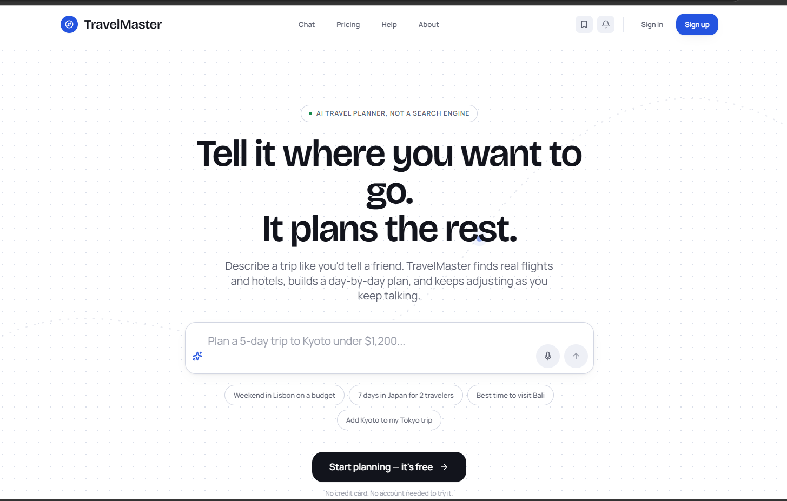
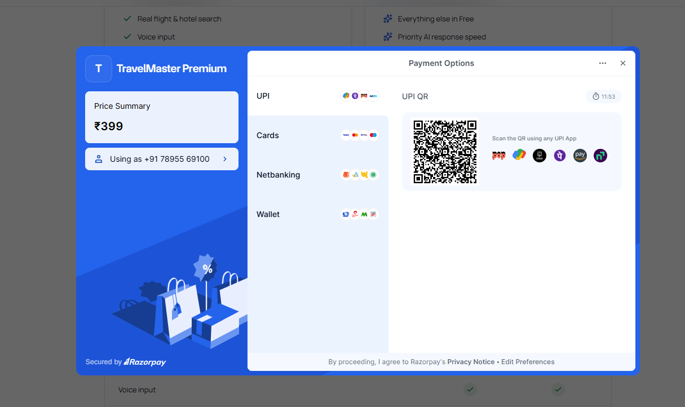
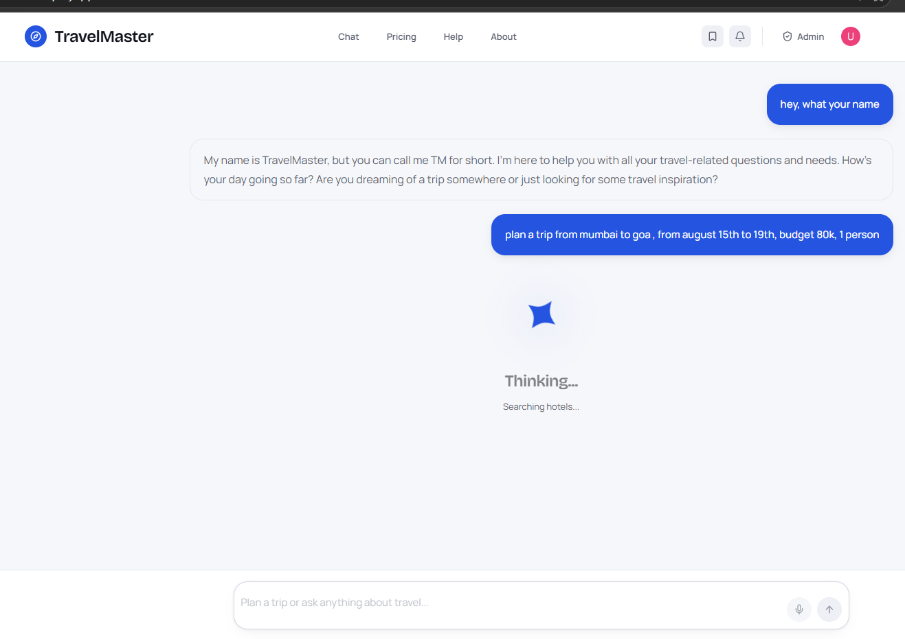
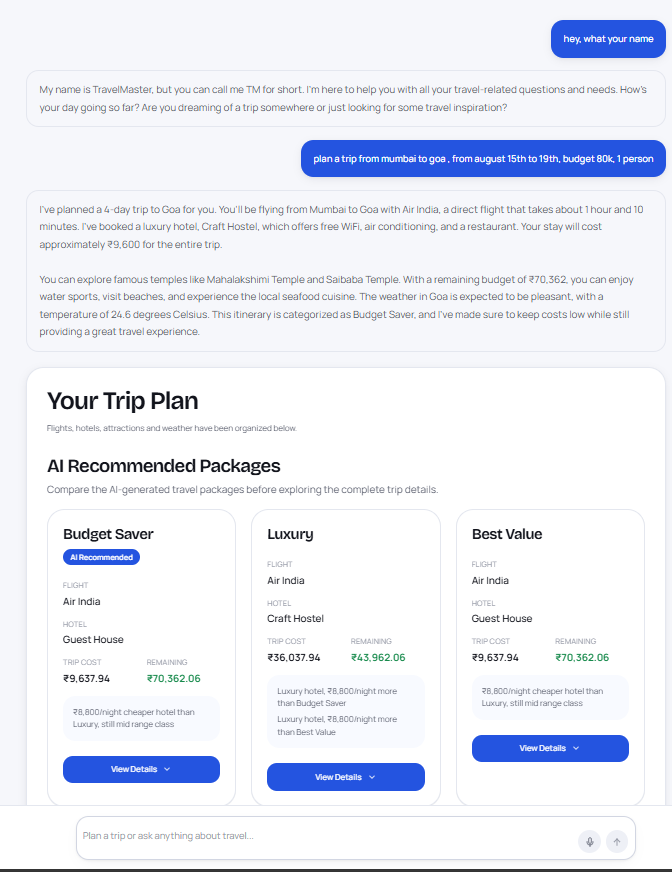
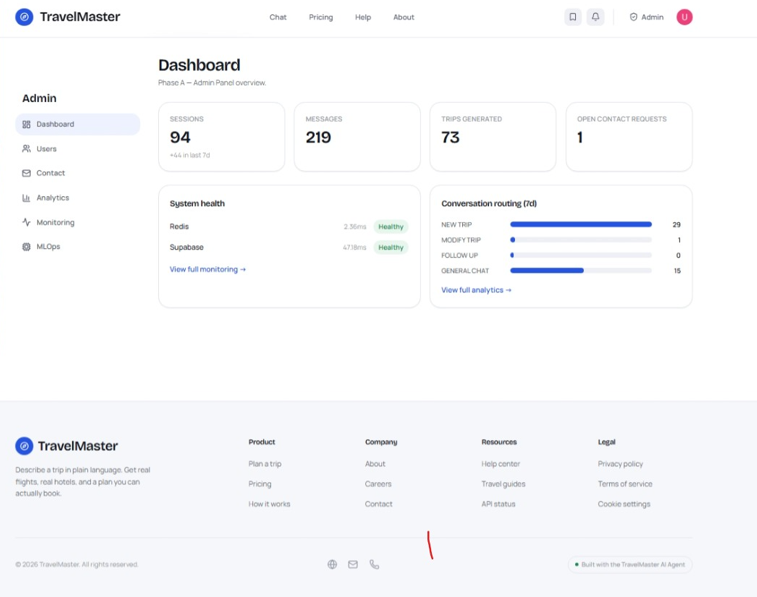
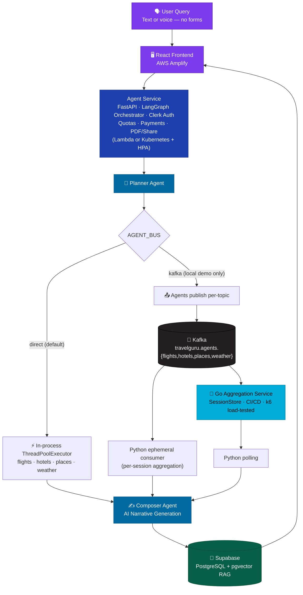

<p align="center">
  <!-- ============================================================ -->
  <!-- REPLACE: Upload your banner to GitHub and paste the URL here -->
  <!-- ============================================================ -->
  
</p>

<p align="center">
  <a href="https://main.d2dqny356lcrsz.amplifyapp.com"></a>
  <a href="https://github.com/uditnegi16/TravelMasterV2"></a>
  <a href="https://github.com/uditnegi16/TravelMasterV2/actions/workflows/backend-ci.yml"></a>
  <a href="https://github.com/uditnegi16/TravelMasterV2/actions/workflows/frontend-ci.yml"></a>
  <a href="https://github.com/uditnegi16/TravelMasterV2/actions/workflows/go-aggregator-ci.yml"></a>
  <a href="#"></a>
</p>

<p align="center">
  
  
  
  
  
</p>

<p align="center">
  
  
  
  
  
  
</p>

<p align="center">
  
  
  
  
  
</p>

---

## Overview

TravelMaster is a full-stack AI SaaS that plans complete trips from a single sentence — no account required for your first trip. Type a natural language query — TravelMaster orchestrates a **LangGraph multi-agent system** that searches flights, hotels, places, and weather **in parallel**, ranks results with a scoring pipeline, transcribes voice input, and generates an AI travel narrative.

It's deployed serverless on **AWS Lambda** by default, with an alternative **Kubernetes deployment (HPA autoscaling 2→8 replicas)** for steady high-throughput traffic, and a production **Kafka event bus** — including a load-tested, CI/CD-backed **Go aggregation microservice** — as a scalable path for consuming agent output at volume. It also ships a full admin panel, tier-based rate limiting, Razorpay payments, PDF export, and shareable trip links.

> *"Plan a 3-day trip from Delhi to Mumbai for 2 adults, budget ₹30k, March 25–27"*
>
> → Ranked flights · Hotels · Places to visit · Weather forecast · Budget breakdown · AI narrative — in seconds. Type it, or say it — voice input is built in.

---

## What's Recently Shipped

A running log of the platform's evolution beyond the original MVP — the parts that tend to matter most to anyone reviewing the engineering, not just the product:

- **Session ownership fixed** — sessions and messages used to be scoped by a client-supplied `device_id`, meaning changing that value gave access to a different user's data. Now scoped by `account_id`, derived server-side from the Clerk JWT (`uuid_generate_v5(uuid_ns_dns(), <clerk sub>)`), consistent across the app and enforced independently by Postgres RLS.
- **PDF delivery fixed** — was streaming a base64 response body through API Gateway without decoding it back to binary, producing a corrupted file on every download. Now uploads to S3 and returns a presigned URL as JSON (not an HTTP redirect, so the frontend never has to depend on the S3 bucket having CORS configured for a cross-origin fetch).
- **Share links hardened** — tokens used to be stored plaintext with no expiry or revocation. Now hashed at rest (SHA-256), expire after 7 days, and can be explicitly revoked by the owner.
- **Guest trial** — a signed-out visitor can plan one full trip with zero account, enforced per-device. Signing in claims that trial session into the new account automatically (an explicit action, not silent) — the trip doesn't just vanish.
- **Real, atomic quota enforcement** — 7 trips/month free, 100/month premium, via Redis `INCR` (not a database column or an in-memory counter), verified concurrency-safe with a test that fires genuinely simultaneous requests at the last remaining slot and confirms exactly one succeeds. Separate burst protection (3 requests/10s) catches rapid-fire abuse independently of the monthly limit.
- **A real account-hijack vulnerability in payments, closed** — `verify_payment` used to treat a valid Razorpay signature as sufficient proof of ownership. It isn't: the signature proves Razorpay legitimately paired an order and payment together, not who initiated the order. A leaked `order_id`/`payment_id`/`signature` triple could activate premium on the wrong account. Orders are now bound to the requesting account at creation time and that binding is checked before activation.
- **Two unauthenticated legacy endpoints removed** (`/plan-trip`, `/generate-pdf`) — no longer used by the frontend, but still live and mounted with zero auth and a trivially client-bypassable "rate limit." Every fix above could be sidestepped by calling these directly; they're gone now, not patched.
- **Real CI, for real** — a pytest suite (not the diagnostic scripts most of this repo's `test_*.py` files still are) gated on every push, with a genuine Postgres+pgvector service container for the RLS/migration tests. A frontend test suite built from zero (Vitest, React Testing Library, MSW, Playwright), also gated on every push.
- **Accessibility pass** — a real axe test caught a genuinely missing accessible name on the main prompt field; fixed. Loading states now use a throttled `aria-live` region instead of announcing nothing (or every streamed token). The one hand-rolled modal in the app now traps focus, closes on Escape, and restores focus on close — none of that existed before.
- **Error handling pass** — a stale-response race that could show one session's messages while looking at a different one, fixed. Failed prompts are now retryable instead of silently lost. An invalid/expired share link now shows a real message instead of either hanging forever or (the actual prior bug) rendering a broken page with the error body treated as valid trip data.
- **Kafka-based agent bus** — agents can publish results to per-topic Kafka streams instead of returning them in-process, toggled with a single env var (`AGENT_BUS=direct|kafka`), with zero change to the trip-planning API surface. Deliberately not deployed 24/7 — see [Kafka Path](#kafka-path-local-demo-only--not-deployed-to-production) for the cost reasoning. See [`docs/kafka-architecture.md`](docs/kafka-architecture.md).
- **Go aggregation microservice** — a standalone, production-hardened Go service that consumes those Kafka topics, merges results by session, and serves them over HTTP. Ships with graceful shutdown, config validation, Prometheus metrics, pprof profiling, and a GitHub Actions CI pipeline (format → vet → test → build → Docker). See [`apps/backend/go-kafka-consumer`](apps/backend/go-kafka-consumer).
- **Load-tested with k6** — benchmarked at 10 / 50 / 100 concurrent virtual users with 0 failed requests across all runs. See [Performance & Load Testing](#performance--load-testing) below.
- **Dual deployment targets for the agent service** — the same LangGraph service ships both as an AWS Lambda (per-invocation scaling, the default) and as a Kubernetes Deployment with an HPA (CPU/memory-based autoscaling for steady-state load). See [`k8s/agent-service`](k8s/agent-service).
- **Resilience patterns** — a circuit breaker around the flights provider, feature flags, and a subscription guard protecting rate-limited endpoints.
- **RAG evaluation harness** — a scored retrieval evaluation suite (`evaluations/evaluate_retrieval.py`) against a fixed test dataset, instead of eyeballing RAG quality.

---

## Demo

<!-- ================================================================ -->
<!-- HOW TO EMBED YOUR VIDEO (GitHub renders MP4 natively):           -->
<!-- 1. Go to your repo → Issues → New Issue                          -->
<!-- 2. Drag and drop your .mp4 file into the comment box             -->
<!-- 3. GitHub generates a URL like:                                  -->
<!--    https://github.com/user/repo/assets/USERID/FILEID.mp4        -->
<!-- 4. Paste that URL below on its own line — no markdown needed     -->
<!-- 5. Delete these instructions after replacing the URL             -->
<!-- ================================================================ -->

YOUR_GITHUB_VIDEO_ASSET_URL_HERE

---

## 🌐 Live Demo

| Service | URL |
|---------|-----|
| Frontend | https://main.d2dqny356lcrsz.amplifyapp.com |
| Agent API (real backend — chat, auth, payments, quotas, everything) | https://wg9p6esygl.execute-api.ap-south-1.amazonaws.com/prod |
| MLOps service (early scaffold, not wired to real functionality — see note below) | https://g2d019moz2.execute-api.ap-south-1.amazonaws.com/prod/health |

> ⚠️ Double-check these are still live before sharing this README externally — endpoints on free/dev AWS tiers tend to drift.

---

## Screenshots

<!-- ================================================================ -->
<!-- HOW TO ADD SCREENSHOTS:                                          -->
<!-- 1. Take screenshots using Windows Snipping Tool (Win+Shift+S)    -->
<!-- 2. Create a /screenshots folder in your repo                     -->
<!-- 3. Upload the images below                                       -->
<!-- 4. The paths below will auto-resolve once images are uploaded    -->
<!-- ================================================================ -->
<!-- Screenshots to capture:                                          -->
<!-- 1. landing.png    — Landing page hero before login               -->
<!-- 2. chat.png       — Chat / plan-trip experience with results     -->
<!-- 3. trip.png       — Flights/hotels/places/weather results        -->
<!-- 4. pdf.png        — Downloaded PDF opened in browser             -->
<!-- 5. admin.png      — Admin dashboard with metrics                 -->
<!-- 6. kafka-ui.png   — Kafka UI showing agent topics (nice touch)   -->
<!-- ================================================================ -->

<p align="center">
  
   
</p>
<p align="center">
  
  
</p>
<p align="center">
  
</p>

---

## System Architecture

<!-- ================================================================ -->
<!-- REPLACE: Upload your architecture diagram to /docs/ in the repo  -->
<!-- and replace the src URL below, or keep the Mermaid diagram below -->
<!-- ================================================================ -->


```mermaid
flowchart TD
    U["🗣️ User Query\nText or voice — no forms"] --> FE["🖥️ React Frontend\nAWS Amplify"]
    FE --> AGENT["Agent Service\nFastAPI · LangGraph Orchestrator · Clerk Auth\nQuotas · Payments · PDF/Share\n(Lambda or Kubernetes + HPA)"]

    AGENT --> PLANNER["🧠 Planner Agent"]
    PLANNER --> ROUTER{"AGENT_BUS"}

    ROUTER -->|"direct (default)"| DIRECT["⚡ In-process ThreadPoolExecutor\nflights · hotels · places · weather"]
    ROUTER -->|"kafka (local demo only)"| PRODUCE["📤 Agents publish per-topic"]

    PRODUCE --> KAFKA[("🧵 Kafka\ntravelguru.agents.{flights,hotels,places,weather}")]
    KAFKA --> PYCONSUMER["Python ephemeral consumer\n(per-session aggregation)"]
    KAFKA --> GOAGG["🐹 Go Aggregation Service\nSessionStore · CI/CD · k6 load-tested"]

    DIRECT --> COMPOSER["✍️ Composer Agent\nAI Narrative Generation"]
    PYCONSUMER --> COMPOSER
    GOAGG --> POLL["Python polling"] --> COMPOSER

    COMPOSER --> DB[("💾 Supabase\nPostgreSQL + pgvector RAG")]
    DB --> FE

    style U fill:#7c3aed,color:#fff,stroke:#5b21b6
    style FE fill:#7c3aed,color:#fff,stroke:#5b21b6
    style AGENT fill:#1e40af,color:#fff,stroke:#1e3a8a
    style PLANNER fill:#0369a1,color:#fff,stroke:#075985
    style KAFKA fill:#231f20,color:#fff,stroke:#000
    style GOAGG fill:#00ADD8,color:#000,stroke:#007d99
    style COMPOSER fill:#0369a1,color:#fff,stroke:#075985
    style DB fill:#065f46,color:#fff,stroke:#064e3b
```

**Note on `mlops_service`:** an earlier architectural plan had a separate service handling auth/payments/rate-limiting, sitting between the frontend and the agent service. That plan never got built out — `apps/backend/mlops_service` is a two-route stub (root + health check) today, and every real piece of that responsibility (Clerk auth, quotas, Razorpay payments, PDF/share) lives directly in `agent_service`, confirmed by reading the actual route files. The diagram above reflects what's actually deployed and running, not the original plan.

**Two independent scaling levers, by design:**

1. **How agent orchestration runs** — `AGENT_BUS=direct` (default, no infra) vs `AGENT_BUS=kafka` (replayable, decoupled, observable via `/admin/kafka/lag`) — **local demo only, not deployed to production** (see [Kafka Path](#kafka-path-local-demo-only--not-deployed-to-production) below for why). Full write-up: [`docs/kafka-architecture.md`](docs/kafka-architecture.md).
2. **Where the agent service runs** — AWS Lambda (default, per-invocation scaling, zero idle cost) vs a Kubernetes Deployment with an HPA (steady-state, predictable-load scaling). Full write-up: [`k8s/agent-service/README.md`](k8s/agent-service/README.md).

---

## Performance & Load Testing

The Go aggregation service was load-tested with **k6** at 10, 50, and 100 concurrent virtual users (30s per run) against `GET /result/{session_id}`, returning a full aggregated trip payload (~625 KB/response).

| Virtual Users | Requests/sec | Avg Latency | p95 Latency | Errors |
|---|---|---|---|---|
| 10  | 490 req/s | 19.97 ms  | 39.24 ms  | 0 |
| 50  | **981 req/s** | 49.60 ms  | 105.16 ms | 0 |
| 100 | 734 req/s | 133.09 ms | 253.38 ms | 0 |

- **66,317 requests served across all benchmark runs — 0 failures, 100% success rate.**
- Throughput scaled nearly linearly from 10→50 VUs; 50→100 VUs showed graceful degradation (throughput dipped ~25%, latency rose ~2.7×) consistent with the service becoming CPU/serialization-bound rather than failing outright.
- Full methodology, per-run breakdowns, and optimization backlog (gzip compression, `sync.Pool`, HTTP/2, response caching) are recorded in [`docs/phase-logs/phase-10.md`](docs/phase-logs/phase-10.md).

---

## Tech Stack

| Layer | Technology |
|-------|-----------|
| Frontend | React 19, Vite, TypeScript, React Router 7, Tailwind CSS, Framer Motion |
| Auth | Clerk (JWT-based, protected routes), plus a first-trip guest path requiring no account at all (device-scoped, one trial session) |
| MLOps Backend | FastAPI stub (`apps/backend/mlops_service`) — early scaffold for a planned auth/payments/rate-limiting layer that was never built out; all of that responsibility lives in the agent service instead |
| AI Agent Service | LangGraph, LangChain, FastAPI, Python 3.12 — deployable to Lambda **or** Kubernetes; also handles auth, quotas, payments, PDF/share |
| LLM | Groq `llama-3.3-70b-versatile`, NVIDIA NIM |
| Voice Input | `faster-whisper` (local CPU transcription, no external API call) |
| Flights | Duffel API, behind a circuit breaker |
| Hotels | OpenStreetMap Nominatim (structured lodging search) |
| Places | OpenTripMap API |
| Weather | Open-Meteo |
| RAG / Knowledge Base | Supabase `pgvector`, with a dedicated retrieval evaluation harness |
| Async Event Bus | Apache Kafka (`kafka-python` on the Python side) — local demo only, not deployed to production |
| High-Throughput Aggregation | **Go 1.24**, `segmentio/kafka-go`, Prometheus client, k6-load-tested |
| Database | Supabase (PostgreSQL + Row-Level Security) |
| Cache / Rate Limiting | Upstash Redis — atomic per-account monthly quotas + burst protection |
| PDF Export | ReportLab + AWS S3 presigned URLs, returned as JSON (not an HTTP redirect, so the frontend never depends on the S3 bucket having CORS configured) |
| Payments | Razorpay (REST API) — orders bound to the requesting account at creation time, verified against that binding before activation |
| Email | AWS SES (boto3) |
| Frontend Hosting | AWS Amplify (CI/CD from GitHub) |
| Backend Hosting | AWS Lambda + API Gateway, **or** Kubernetes (Deployment + HPA + Service) |
| Infrastructure as Code | AWS SAM (Lambda), raw manifests (Kubernetes) |
| CI/CD | GitHub Actions — real pytest suite + coverage gate for the backend (Postgres service container for DB/RLS tests), Vitest + Playwright + coverage gate for the frontend, plus format/vet/test/build/Docker for the Go aggregation service |
| Testing | Vitest + React Testing Library + MSW + axe (frontend), pytest + pytest-cov + a real Postgres+pgvector replica (backend), Playwright (frontend smoke tests, local dev server) |
| Observability | AWS CloudWatch, Prometheus metrics + pprof (Go service), Kafka consumer-lag endpoint |

---

## Features

- **Natural Language Planning** — no forms, no dropdowns, describe the trip in plain English (or speak it)
- **Guest Trial** — plan one full trip with zero account required; signing in later claims that trip into your account automatically
- **Voice Input** — on-device transcription via `faster-whisper`, no third-party voice API dependency
- **LangGraph Multi-Agent** — planner agent → tool router → composer agent, with flights/hotels/places/weather fetched in parallel
- **Resilience Built In** — circuit breaker around the flights provider, feature flags, subscription guard on rate-limited routes
- **Kafka Event Bus (local demo only)** — swap the in-process agent pipeline for a Kafka-mediated one with one env var; replay any session's raw agent output for debugging, observe per-topic consumer lag. Not deployed to production — see [Kafka Path](#kafka-path-local-demo-only--not-deployed-to-production)
- **Go Aggregation Microservice** — a purpose-built, benchmarked, CI-tested Go service for consuming agent output at volume
- **Tier-Based Rate Limiting** — 7 trip plans/month free, 100/month premium, enforced atomically via Redis (concurrency-safe — verified with real concurrent-request tests, not just sequential ones); currently a fixed constant per tier, not yet admin-editable without a redeploy
- **Session History** — all past trips saved, searchable, re-openable
- **PDF Export** — full trip plan via an AWS S3 presigned URL, ownership-checked before generation
- **Trip Sharing** — public read-only link, no login required; tokens are hashed at rest and expire after 7 days
- **Payments** — Razorpay checkout for premium tier upgrades; orders are bound to the requesting account at creation and verified against that binding before activation, closing a real account-hijack gap that existed earlier in this project's history
- **Contact & Support Flow** — public contact form with a triage workflow (`new → in_progress → resolved`) in the admin panel
- **Admin Suite** — dashboard, user role/ban management, live health checks, Kafka monitoring, MLOps status, analytics, contact triage
- **Dark / Light Mode** — system preference detection with manual toggle and persistence
- **Dual Deployment** — the agent service runs identically on Lambda (serverless) or Kubernetes (HPA-autoscaled)
- **RAG Quality Evaluation** — a scored retrieval eval harness against a fixed test dataset, not manual spot-checks
- **Real Error Handling** — failed prompts are retryable, not silently lost; switching conversations mid-request can't show the wrong session's messages; expired/invalid share links show a real message instead of hanging
- **Accessibility** — live-region status announcements during trip planning (throttled to stage changes, not every streamed token), full keyboard focus trapping in the one hand-rolled modal, `prefers-reduced-motion` respected throughout
- **Email Notifications** — welcome, limit reached, trip ready — via AWS SES

---

## Why TravelMaster

| Traditional Travel Apps | TravelMaster |
|------------------------|-------------|
| Search forms with dropdowns | Plain English (or voice) natural language input |
| Manual comparison across tabs | AI-ranked results in one view |
| Static results, no scoring | Scoring pipeline across price, rating, convenience |
| No narrative or context | Full budget breakdown + AI trip narrative |
| No admin control | Ops dashboard with real-time Kafka lag monitoring, user role/ban management, contact triage |
| Sign up before you can try it | Guest trial — plan one trip with zero account, claimed into your account automatically if you sign in |
| One deployment target | Ships to Lambda *or* Kubernetes from the same codebase |
| "It works on my machine" | Real CI on every push: pytest + coverage gate against a live Postgres for the backend, Vitest + Playwright + coverage gate for the frontend, format/vet/test/build/Docker for the Go service |

---

## Infrastructure

| Service | Purpose |
|---------|---------|
| AWS Amplify | Frontend hosting + auto CI/CD from GitHub push |
| AWS Lambda | MLOps backend + Agent backend (serverless, default) |
| Kubernetes (EKS-compatible manifests) | Alternative agent-service deployment — 2–8 replica HPA, `travelguru` namespace |
| Amazon API Gateway | Public HTTPS endpoints for both Lambdas |
| Amazon S3 (`travelmaster-pdfs`) | PDF storage + presigned URL delivery |
| AWS SAM | Infrastructure as code for the Lambda deployments |
| Apache Kafka | Async agent-result event bus (`infra/kafka/docker-compose.yml` for local dev) |
| Amazon CloudWatch | Lambda logs and error monitoring |
| AWS SES | Transactional emails |
| GitHub Actions | CI pipelines for the backend (real pytest suite + coverage gate), the frontend (Vitest + Playwright + coverage gate), and the Go aggregation service (format/vet/test/build/Docker) |

---

## Local Development

### Prerequisites

- Python 3.12
- Node.js 18+
- Go 1.24 (only needed if you're working on the Kafka aggregation path)
- [uv](https://github.com/astral-sh/uv) — `pip install uv`
- Docker (for local Kafka, optional)
- Supabase account + project
- Clerk account
- [Duffel](https://duffel.com) API token (flights, sandbox available)
- Groq API key — free at [console.groq.com](https://console.groq.com)
- [OpenTripMap](https://opentripmap.io) API key (places)
- Razorpay account (payments, optional for local dev)

> Hotels (Nominatim) and weather (Open-Meteo) need no API key.

### Clone

```bash
git clone https://github.com/uditnegi16/TravelMasterV2.git
cd TravelMasterV2
```

### Terminal 1 — Agent Service (LangGraph)

```bash
cd apps/backend/agent_service
```

Create a `.env` with (see `services/*.py` for the full list each service reads):

```env
DUFFEL_API_TOKEN=your_duffel_token
OPENTRIPMAP_API_KEY=your_opentripmap_key
GROQ_API_KEY=your_groq_key
SUPABASE_URL=https://your-project.supabase.co
SUPABASE_SECRET_KEY=your_service_role_key
CLERK_SECRET_KEY=your_clerk_secret_key
CLERK_JWKS_URL=https://your-clerk-domain.clerk.accounts.dev/.well-known/jwks.json
RAZORPAY_KEY_ID=your_razorpay_key_id
RAZORPAY_KEY_SECRET=your_razorpay_key_secret
UPSTASH_REDIS_REST_URL=your_redis_url
UPSTASH_REDIS_REST_TOKEN=your_redis_token
AGENT_BUS=direct
```

> Auth, payments, and quotas all live in this service, not `mlops_service` (see the architecture note above) — Clerk, Razorpay, and Redis credentials genuinely belong here, not there.

Install and run:

```bash
uv venv
source .venv/bin/activate   # .venv\Scripts\activate on Windows
uv pip install -r requirements.txt
uvicorn main:app --reload --port 8001
```

✅ Agent service running at `http://127.0.0.1:8001`

### Terminal 2 — MLOps Backend

```bash
cd apps/backend/mlops_service
```

This service is a stub (root route + health check, see the architecture note above) — it doesn't currently read any environment variables. No `.env` is needed to run it.

Run:

```bash
uv venv
source .venv/bin/activate
uv pip install -r requirements.txt
uvicorn main:app --reload --port 8000
```

✅ MLOps backend running at `http://127.0.0.1:8000`

### Terminal 3 — Frontend

```bash
cd apps/frontend
```

Create a `.env` from `.env.example`:

```env
VITE_API_BASE=http://127.0.0.1:8001
VITE_CLERK_PUBLISHABLE_KEY=pk_test_your_clerk_publishable_key
VITE_RAZORPAY_KEY_ID=your_razorpay_key_id
```

> Points at the agent service (Terminal 1, port 8001) — that's where chat, auth, payments, and quotas actually live, not the MLOps stub on port 8000.

Run:

```bash
npm install
npm run dev
```

✅ Frontend running at `http://localhost:5173`

---

## Kafka Path (Local Demo Only — Not Deployed to Production)

**Why this isn't running in AWS:** the Kafka bus and Go aggregation service are fully built, tested, and CI-gated — but deliberately not deployed 24/7. Managed Kafka hosting (AWS MSK) bills a fixed rate per cluster-hour regardless of traffic (~$0.75/cluster-hour on MSK Serverless, more on Provisioned) — running it continuously doesn't make economic sense for a project with sporadic traffic. The intended path to running this live for real is [Confluent Cloud's Basic tier](https://www.confluent.io/confluent-cloud/), which genuinely scales to $0 at zero usage and bills per-GB only when actually processing data. For demos (portfolio reviews, interviews), the local path below is the better choice anyway — it's interactive, costs nothing, and doesn't depend on any cloud infrastructure being provisioned in advance.

**To run it locally** (bash):

```bash
docker compose -f infra/kafka/docker-compose.yml up -d
# Kafka on localhost:9092, Kafka UI on http://localhost:8080

cd apps/backend/agent_service
export AGENT_BUS=kafka
export KAFKA_BOOTSTRAP_SERVERS=localhost:9092
uvicorn main:app --reload --port 8001
```

**PowerShell equivalent:**

```powershell
docker compose -f infra/kafka/docker-compose.yml up -d

cd apps\backend\agent_service
$env:AGENT_BUS = "kafka"
$env:KAFKA_BOOTSTRAP_SERVERS = "localhost:9092"
uvicorn main:app --reload --port 8001
```

With `AGENT_BUS=kafka` set, planning a trip through the live chat flow (`POST /chat/sessions/{id}/messages`, the same endpoint the app always uses) routes agent orchestration through Kafka instead of the in-process default — `travelguru.agents.{flights,hotels,places,weather}` carry real messages, inspectable live in Kafka UI (`localhost:8080`) or via `GET /admin/kafka/lag`. Full architecture details: [`docs/kafka-architecture.md`](docs/kafka-architecture.md).

### Go Aggregation Service

```bash
cd apps/backend/go-kafka-consumer
go mod download
go run .
```

**Verify it's actually working, not just running:**

```bash
go test ./... -race
go build .
```

Runs three HTTP servers: the aggregation API (`:8081`, results at `GET /result/{session_id}`, health at `/health/live` and `/health/ready`), Prometheus metrics (`:2112/metrics`), and pprof (`:6060`). Config is env-driven and validated at startup — see `internal/config/config.go`. Requires **Go 1.24+** (`go.mod` pins this explicitly — an older toolchain will refuse to build rather than fail silently).

Run the test suite / CI checks locally:

```bash
gofmt -l .
go vet ./...
go test ./... -v -race
go build .
```

---

## AWS Deployment (Lambda)

### Prerequisites

- AWS CLI configured (`aws configure`)
- SAM CLI installed — [install guide](https://docs.aws.amazon.com/serverless-application-model/latest/developerguide/install-sam-cli.html)
- S3 bucket: `aws s3 mb s3://travelmaster-pdfs --region ap-south-1`

### Deploy Agent Lambda

```bash
cd apps/backend/agent_service
sam build
sam deploy --guided
```

Stack name: `travelguru-agent-service` · Region: `ap-south-1`

> A stack named `travelmaster-agent` also exists in this project's AWS account, created earlier and left in place rather than deleted — it is **not** the live stack and should not be deployed to. `travelguru-agent-service` is the one `VITE_API_BASE` actually points at.

### Deploy MLOps Lambda

```bash
cd apps/backend/mlops_service
sam build
sam deploy --guided
```

Stack name: `travelmaster-mlops` · Region: `ap-south-1`

> This deploys the MLOps stub described above — a root route and a health check, nothing more. There's no real functionality here to break by skipping this step.

### Deploy Frontend

Push to `main` — Amplify auto-deploys on every push.

**Required Amplify environment variables:**

```
VITE_CLERK_PUBLISHABLE_KEY = pk_live_your_key
VITE_API_BASE = https://wg9p6esygl.execute-api.ap-south-1.amazonaws.com/prod
VITE_RAZORPAY_KEY_ID = your_razorpay_key_id
```

---

## Kubernetes Deployment (Alternative to Lambda)

The agent service also ships as a standalone Kubernetes Deployment — same codebase, different entrypoint (`uvicorn main:app` via `Dockerfile.k8s` instead of the Lambda handler), for workloads that benefit from steady-state HPA autoscaling instead of per-invocation Lambda scaling.

```bash
cd apps/backend/agent_service
docker build -f Dockerfile.k8s -t travelguru/agent-service:latest .

kubectl apply -f ../../../k8s/agent-service/namespace.yaml
kubectl apply -f ../../../k8s/agent-service/configmap.yaml

cp ../../../k8s/agent-service/secret.example.yaml /tmp/secret.yaml
# fill in /tmp/secret.yaml, then:
kubectl apply -f /tmp/secret.yaml
rm /tmp/secret.yaml

kubectl apply -f ../../../k8s/agent-service/deployment.yaml
kubectl apply -f ../../../k8s/agent-service/service.yaml
kubectl apply -f ../../../k8s/agent-service/hpa.yaml
```

Scales 2→8 replicas on CPU (70%) / memory (80%) utilization. Full details: [`k8s/agent-service/README.md`](k8s/agent-service/README.md).

---

## Database Setup

Run these, in order, in your Supabase SQL editor. This exact order was verified end-to-end against a real, blank Postgres 16 + pgvector instance (2026-08-03) — every file applies cleanly with zero errors:

1. 📄 [`database/schema.sql`](database/schema.sql) — core tables
2. 📄 [`database/indexes.sql`](database/indexes.sql) — indexes
3. 📄 [`database/match_travel_knowledge.sql`](database/match_travel_knowledge.sql) — pgvector similarity search function for RAG
4. 📄 [`database/rls_and_admin_users_migration.sql`](database/rls_and_admin_users_migration.sql) — Row-Level Security policies + the `user_db.admin_users` table. **Also requires manual dashboard configuration**: Supabase Dashboard → Authentication → Third-Party Auth → add Clerk as a provider, and enable the Supabase JWT integration on the Clerk side. Without this, RLS-bound requests are forwarded a Clerk token Supabase has no way to validate.
5. 📄 [`database/share_token_hashing_migration.sql`](database/share_token_hashing_migration.sql) — adds `share_token_hash`/`share_token_expires_at`/`share_token_revoked_at`, backfills any existing plaintext tokens
6. 📄 [`database/admin_panel_migration.sql`](database/admin_panel_migration.sql) — admin panel contact-triage workflow (adds `status` to `contact_messages`)

---

## Admin Setup

Admin access is checked from a `role` claim in the Clerk session token (`core/auth.py::require_admin` reads `metadata.role`, or a top-level `role`, from the JWT payload — not from the database). `user_db.admin_users` exists in the schema but isn't wired into this check yet; inserting into it does nothing for authorization today, it's an audit-trail table for a follow-up.

To actually grant yourself admin access:

1. Clerk Dashboard → Users → your account → **Metadata** → add to **Public metadata**:
   ```json
   { "role": "admin" }
   ```
2. Clerk Dashboard → **Sessions** → **Customize session token** → make sure `metadata` (or `public_metadata`) is included as a claim, so it actually shows up in the JWT `require_admin` reads.
3. Sign out and back in on the live app (or otherwise force a fresh token) → you'll be routed to `/admin/dashboard`.

---

## User Tiers

| Feature | Free | Premium |
|---------|------|---------|
| AI trip searches / month | **7** | **100** |
| Flights + Hotels + Places | ✅ | ✅ |
| Weather + Budget breakdown | ✅ | ✅ |
| Voice input | ✅ | ✅ |
| Session history | ✅ | ✅ |
| Save trips | ✅ | ✅ |
| PDF export | ✅ | ✅ |
| Shareable trip links | ✅ | ✅ |

> Limits reset automatically at the start of every calendar month (the Redis key is scoped to `account_id:YYYY-MM`, so a new month is a new key). There's no admin-facing manual reset yet.

---

## Admin Panel

| Page | Purpose |
|------|---------|
| Dashboard | Business metrics — users, searches, success rate |
| Users | List users, change role, ban/unban |
| Health | Live Lambda + Supabase service status |
| Monitoring | Kafka consumer lag and cluster health (`/admin/kafka/*`) |
| MLOps | MLOps service status and metrics |
| Analytics | Usage trends over time |
| Contact | Contact form submissions with a `new → in_progress → resolved` triage workflow |

> Not real yet, despite being described in earlier drafts of this README: editable rate limits/feature flags, a per-user manual quota reset, and an audit log. None of these have a backing endpoint in `admin_routes.py` — confirmed by reading the actual route list, not assumed.

---

## Common Issues

**Flights come back empty** — check `DUFFEL_API_TOKEN`; the flights service is wrapped in a circuit breaker, so a bad/missing token trips it open rather than retrying indefinitely.

**Places search unavailable** — `OPENTRIPMAP_API_KEY` isn't set. It's required; there's no fallback provider currently wired in for places.

**Hotels/places search feels slow or occasionally empty** — hotel and (fallback) place lookups hit OpenStreetMap's public Nominatim instance, which enforces a strict 1 request/sec policy. This is a known, documented tradeoff of using a free geocoder.

**`Invalid API key` (Supabase)** — ensure `SUPABASE_SERVICE_ROLE_KEY` starts with `eyJ` with no surrounding whitespace.

**Monthly quota reached** — quotas are enforced in Redis, not a database column (key format `quota:monthly:<account_id>:<YYYY-MM>`, see `shared/quota_guard.py`). To manually clear one for testing, delete that key directly via `redis-cli` or the Upstash console — there's no admin-panel or SQL-based reset yet.

**PDF corrupted** — ensure S3 presigned URL delivery is used, not a direct binary response through API Gateway.

**Go service: `go: go.mod requires go >= 1.24`** — install Go 1.24+; the aggregation service is pinned to match its dependencies' minimum version.

---

## Project Structure

```
TravelMasterV2/
├── apps/
│   ├── backend/
│   │   ├── agent_service/            ← LangGraph AI agent (FastAPI)
│   │   │   ├── graph/                ← Planner, Composer, Tool Router, Kafka aggregator node
│   │   │   ├── services/             ← Duffel, OpenTripMap, Open-Meteo, Nominatim, Razorpay, Whisper
│   │   │   ├── shared/                ← Circuit breaker, feature flags, subscription guard, cache
│   │   │   ├── retrieval/            ← RAG chunking, embedding, reranking
│   │   │   ├── evaluations/          ← Retrieval quality evaluation harness
│   │   │   ├── kafka_bus/            ← Kafka producer/consumer, admin/lag helpers
│   │   │   ├── api/                  ← chat, admin, payment, contact, voice, kafka-monitor routes
│   │   │   ├── lambda_handler.py     ← AWS Lambda entry point
│   │   │   ├── Dockerfile            ← Lambda container image
│   │   │   ├── Dockerfile.k8s        ← Kubernetes container image
│   │   │   └── template.yml          ← SAM deployment config
│   │   ├── mlops_service/            ← FastAPI stub (root route + health check only; not the auth/payments layer -- that's in agent_service)
│   │   │   ├── utils/                ← Health logging, etc.
│   │   │   └── lambda_handler.py     ← AWS Lambda entry point
│   │   └── go-kafka-consumer/        ← Go aggregation microservice
│   │       ├── internal/
│   │       │   ├── aggregator/       ← Session aggregation + trip builder
│   │       │   ├── api/              ← HTTP API (results, health endpoints)
│   │       │   ├── config/           ← Env-driven, validated configuration
│   │       │   ├── kafka/            ← Kafka consumer
│   │       │   └── metrics/          ← Prometheus metrics
│   │       ├── benchmarks/           ← k6 load test script
│   │       └── Dockerfile
│   └── frontend/                     ← React app (AWS Amplify)
│       ├── src/app/routes/           ← Public, app, and admin/ pages
│       └── src/app/components/       ← Shared UI, chat, trip result components
├── infra/kafka/                      ← Local Kafka + Kafka UI docker-compose
├── k8s/agent-service/                ← Kubernetes manifests (Deployment, HPA, Service, ConfigMap)
├── database/                         ← SQL schema, indexes, RAG search function, migrations
├── knowledge_base/                   ← RAG source documents (destinations, visas, budgets, etc.)
├── docs/                             ← Architecture notes, phase logs, decision log
└── README.md
```

---

## License

MIT — built for portfolio demonstration purposes.

---

<p align="center">
  Built with ☕ and frustration in India 🇮🇳
</p>
